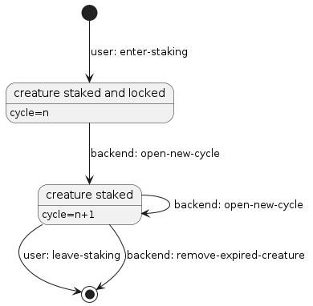

# Creature staking flows and responsibilities

When user owns (mints) a creature, he or she can stake it. This
article describes the process of staking as is currently
implemented by the contracts. 
    
## Staking process

As a prerequisite to participate in staking user needs to be the
owner of create NFT at the time he opens a staking position. 

Staking process is governed by `creature-racer-staking-v4`
contract.

### Opening position
**User** does so by calling `enter-staking` function. This
transfers  the NFT to staking contract.

As long as the position is open, user's share can be obtained
from contract by calling `get-user-share` function.

### Cycle control

**Backend** is responsible for triggering cycle changes. Backend
does so by calling `open-new-cycle` function on the staking
contract.

### Closing position

Position can be closed by the **user** by calling
`leave-staking`.

Also, **backend** can unstake creature by calling
`remove-expired-creature` function.

## Backend responsibilities

### Setting creature weights

Creature weights are set in `creature-racer-nft-v4` contract
(`set-part-values` function).

### Managing cycles

Backend manages cycles by calling `open-new-cycle` functions of
`creature-racer-staking-v4` and `create-racer-reward-pool-v3`
contracts.

### Signing withdrawal requests

Backend should track how much STX a user is allowed to withdraw
from reward and referral pools and digitally sign frontend
requests for withdrawal

## Frontend responsibilities

Frontend issues calls to open and close user positions. It also
initiates fund withdrawals (withdrawal requests should be
negotated with the backend).
